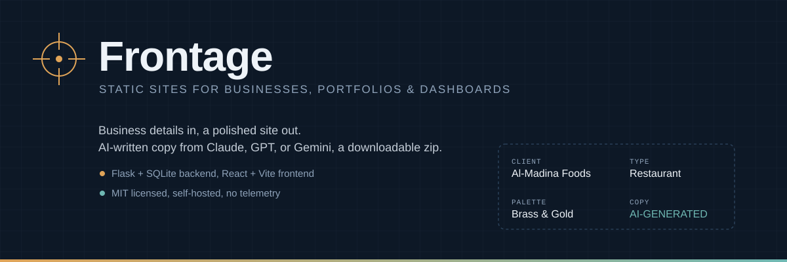
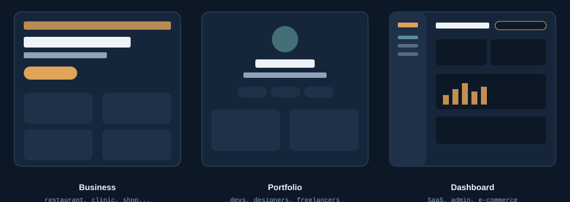
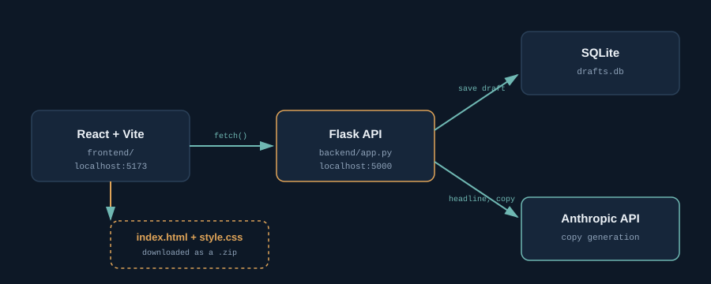

<div align="center">



### Business details in. A polished site out.

Frontage generates production-ready starter sites - local businesses, personal
portfolios, and product dashboards - complete with AI-written copy, a curated
color system, SEO basics, and a one-click ZIP export.

<p>


</p>

[Quick Start](#-quick-start) &bull; [Features](#-features) &bull; [Architecture](#-architecture) &bull; [Contributing](#-contributing)

</div>

<br>

## What you can build



| Kind | For | Types included |
|---|---|---|
| **Business** | Local storefronts | Restaurant, pharmacy, dentist, salon, retail, real estate, education, general services |
| **Portfolio** | Personal sites | Developer, designer, freelancer / consultant |
| **Dashboard** | Product / demo UIs | SaaS analytics, admin panel, e-commerce |

## Features

### Multi-provider AI copy
Bring your own key for **Claude (Anthropic)**, **GPT (OpenAI)**, or **Gemini (Google)**.
Frontage auto-detects whichever is configured, or force one via `AI_PROVIDER`. No key
at all still works - every type ships with solid placeholder copy.

### Design system
8 curated palettes, or drop into custom mode with native color pickers for every CSS
variable. Logo/avatar upload with automatic resizing, embedded directly into the
export as a data URI. Auto-generated monogram favicon when no logo is provided.

### Local business essentials
Address, hours, and an embedded Google Map. Meta description, Open Graph tags, and
schema.org JSON-LD structured data, mapped per type for better search visibility.
WhatsApp deep links that correctly normalize local Pakistani number formats.

### Live dashboard mockups
Sidebar nav, stat cards, a weekly trend chart, and a recent-activity feed - all
static, all clearly labeled as sample data, built from your own nav items and metric
labels.

### Draft history
Every generation auto-saves to a local SQLite database. Regenerating copy updates the
same draft instead of piling up duplicates. Browse, reload, or delete past work from
the Drafts panel.

### Accessible by default
Skip-to-content links, visible focus states, alt text, and semantic landmarks baked
into every export.

## Architecture



Two independent services over a local HTTP API:

- **`frontend/`** - React + Vite. The form, the live preview (sandboxed iframe),
  the drafts drawer, the download.
- **`backend/`** - Flask. Owns type/palette config, calls whichever AI provider
  is configured, renders via Jinja2, persists drafts to SQLite, builds the export ZIP
  in memory.

Nothing leaves your machine except the AI call for copywriting, which is entirely
optional.

## Quick Start

### Prerequisites

- Python 3.10+
- Node.js 18+
- An API key from [Anthropic](https://console.anthropic.com/), [OpenAI](https://platform.openai.com/), or [Google AI Studio](https://aistudio.google.com/) - optional, the tool falls back to placeholder copy without one

### 1. Clone

```bash
git clone https://github.com/LwkMoon/frontage.git
cd frontage
```

### 2. Backend

```bash
cd backend
python3 -m venv venv
source venv/bin/activate      # Windows: venv\Scripts\activate
pip install -r requirements.txt

copy .env.example .env
```

Open `.env` and add **any one** of these: (Adding API Key is optional)

```bash
ANTHROPIC_API_KEY=sk-ant-...
OPENAI_API_KEY=sk-...
GEMINI_API_KEY=...
```

Set more than one and Frontage picks Anthropic &gt; OpenAI &gt; Gemini automatically,
or force a specific provider:

```bash
AI_PROVIDER=openai
```

Then run it:

```bash
python app.py
```

Backend is live at `http://localhost:5000`. A `drafts.db` SQLite file is created
automatically on first run (gitignored, stays local to you).

> Run `python selftest.py` first for a fast sanity check - it exercises every
> type across all three site kinds and works with or without an API key.

### 3. Frontend

```bash
cd frontend
npm install
copy .env.example .env   # only needed if the backend isn't on localhost:5000
npm run dev
```

Frontend is live at `http://localhost:5173`.

## 📖 Usage

1. Pick a kind - **Business**, **Portfolio**, or **Dashboard**.
2. Fill in identity, appearance (palette or custom colors), and the kind-specific
   details.
3. Claude/GPT/Gemini writes the headline, tagline, and supporting copy.
4. Preview live, regenerate copy as many times as you like, then download a
   ready-to-edit ZIP.
5. Everything auto-saves along the way - reopen any past draft from **Drafts**.

## 📁 Project structure

```
frontage/
├── backend/
│   ├── app.py                    Flask app: routes, rendering, JSON-LD, SEO
│   ├── site_kinds.py              Registry: kind → types + template
│   ├── business_types.py          Business type configs
│   ├── portfolio_types.py         Portfolio type configs
│   ├── dashboard_types.py         Dashboard type configs
│   ├── palettes.py                Curated palettes + custom color resolution
│   ├── db.py                      SQLite draft persistence
│   ├── selftest.py                End-to-end sanity check, no server required
│   ├── services/
│   │   ├── ai_provider.py         Multi-provider AI calling (Claude/GPT/Gemini)
│   │   ├── prompts.py             Prompt construction per kind
│   │   ├── demo_data.py           Deterministic sample data for dashboards
│   │   └── images.py              Logo processing + favicon generation
│   └── templates_data/
│       ├── business.html.jinja    Business template
│       ├── portfolio.html.jinja   Portfolio template
│       ├── dashboard.html.jinja   Dashboard template
│       ├── base.css.jinja         Shared CSS (business + portfolio)
│       └── dashboard.css.jinja    Dashboard-specific layout CSS
└── frontend/
    └── src/
        ├── App.jsx                 Top-level state, draft lifecycle
        ├── api.js                  Backend API client
        └── components/
            ├── KindSelector.jsx    Business / Portfolio / Dashboard switcher
            ├── BusinessForm.jsx
            ├── PortfolioForm.jsx
            ├── DashboardForm.jsx
            ├── PreviewPane.jsx      Live preview + export
            └── HistoryDrawer.jsx    Draft browser
```

## Extending it

**New business/portfolio/dashboard type** - add an entry to the relevant
`*_types.py` file: label, layout, icon, fallback copy. No template changes needed.

**New palette** - add an entry to `PALETTES` in `backend/palettes.py` with six
CSS variables.

**New AI provider** - add a caller function to `services/ai_provider.py`
following the existing pattern.

See [CONTRIBUTING.md](CONTRIBUTING.md) for the full guide.

## Roadmap

- [ ] Multi-page export (Home / About / Contact) as an alternative to single-page
- [ ] Direct deploy to Vercel/Netlify from the UI
- [ ] Image gallery section for uploaded photos beyond the logo
- [ ] Bilingual export (English + Urdu) with RTL support
- [ ] Docker Compose for one-command local start

Have an idea that's not listed? [Open an issue](../../issues).

## Contributing

New types and palettes are the easiest way to add real value in a single PR. See
[CONTRIBUTING.md](CONTRIBUTING.md) for setup, guidelines, and what a good PR looks
like here.

## Notes

- Per-provider model overrides live in `.env`: `ANTHROPIC_MODEL`, `OPENAI_MODEL`,
  `GEMINI_MODEL`.
- The Google Maps embed uses the no-API-key `output=embed` URL pattern.
- Uploaded logos are capped at 3MB and resized to 480px max before embedding.
- Dashboard numbers are deterministic sample data, always labeled as such -
  never presented as real analytics.
- Built as a local, single-user tool: no auth, no rate limiting. Put it behind auth
  before deploying anywhere reachable over a network.

## License

MIT - see [LICENSE](LICENSE). Use it, fork it, ship it for clients, whatever's
useful.

<div align="center">

---

Built by [LwkMoon](https://github.com/LwkMoon)

</div>
